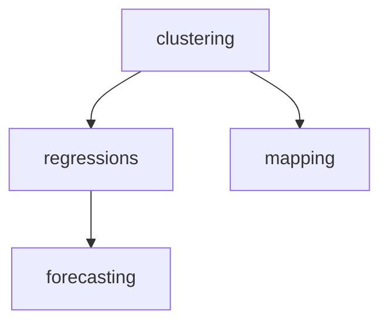

# Set of functions to process weather data



This project performs a full pipeline of **clustering**, **mapping**, **temperature trend regression**, and **forecasting** on weather station data. It uses machine learning and data visualization techniques to analyze temperature trends from a dataset of stations with geographic and climate features.

## 📁 Project Structure

- `forecasting.py`: Contains logic for temperature forecasting per station.
- `clustering.py`: Implements KMeans clustering for grouping stations.
- `regressions.py`: Applies linear regression to analyze temperature trends within each cluster.
- `mapping.py`: Plots clustered stations on a geographic map.
- `with_states.csv`: Input dataset with weather station records and metadata.
- `states.geojson`: GeoJSON file used to render state boundaries.
- `results/`: Directory where forecast plots are saved.

## 📊 Features

1. **Clustering**  
   Uses KMeans to group stations based on:
   - Temperature (`TEMP`)
   - Precipitation (`PRCP`)
   - Elevation
   - Latitude
   - Longitude

2. **Mapping**  
   Visualizes station clusters on a map using a GeoJSON shapefile of U.S. states.

3. **Regression**  
   For each cluster:
   - Extracts yearly average temperature.
   - Converts temperature from Fahrenheit to Celsius.
   - Performs linear regression to observe trends over years.
   - Saves regression plots.

4. **Forecasting**  
   Forecasts future temperatures for each station for the next 100 days and generates forecast plots.

## ▶️ Usage

Run the pipeline with:

```bash
python simple_flow.py
```

> Ensure that `with_states.csv` and `states.geojson` are present in the same directory or update the paths in the script accordingly.

## 🛠 Requirements

Install the necessary Python packages:

```bash
pip install pandas matplotlib scikit-learn geopandas statsmodels
```

## 📦 Output

- **Clustering results** saved via `clus.save_results()`.
- **Map** of clustered stations saved as `station_clusters_map.png`.
- **Regression plots** per cluster saved as `regression_results_cluster_<i>.png`.
- **Forecast plots** per station saved in the `results/` directory.

## 🧾 Dataset Format

The `with_states.csv` file should contain the following columns:

- `STATION`: Station identifier
- `DATE`: Observation date
- `TEMP`: Temperature in Fahrenheit
- `PRCP`: Precipitation
- `ELEVATION`: Station elevation
- `LATITUDE`: Latitude
- `LONGITUDE`: Longitude

## 📍 Notes

- Year 2025 data is excluded from regression.
- Ensure that the `DATE` column is properly formatted to datetime.
- All temperatures are converted to Celsius before regression and forecasting.